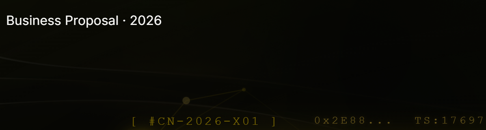

# 🚀 网页PPT技巧与资源大全

## 📚 核心技能清单

### 1. 框架选择

#### **Reveal.js**（推荐）
- 官网：https://revealjs.com
- 特点：功能强大、插件丰富、社区活跃
- 适合：技术演讲、学术报告
- 下载：`npm install reveal.js`

#### **Impress.js**
- 官网：https://impress.js.org
- 特点：3D效果、旋转缩放
- 适合：创意展示、产品发布

#### **Swiper.js**
- 官网：https://swiperjs.com
- 特点：移动端友好、触摸滑动
- 适合：移动端PPT、H5页面

---

## 🎨 设计资源

### 配色工具
1. **Coolors** - https://coolors.co
   - 快速生成配色方案
   - 支持导出CSS

2. **Adobe Color** - https://color.adobe.com
   - 专业配色轮
   - 色彩和谐规则

3. **Gradient Generator** - https://cssgradient.io
   - CSS渐变生成器
   - 实时预览

### 图标资源
1. **Lucide Icons** - https://lucide.dev
   - 简洁、现代
   - 支持SVG、React

2. **Heroicons** - https://heroicons.com
   - Tailwind官方图标
   - 免费开源

3. **Feather Icons** - https://feathericons.com
   - 极简风格
   - 轻量级

### 背景纹理
1. **Hero Patterns** - https://heropatterns.com
   - SVG背景图案
   - 可自定义颜色

2. **Cool Backgrounds** - https://coolbackgrounds.io
   - 渐变、粒子背景
   - 一键生成

---

## 💻 开发工具

### 在线编辑器
1. **CodePen** - https://codepen.io
   - 实时预览
   - 社区分享

2. **JSFiddle** - https://jsfiddle.net
   - 快速测试
   - 多框架支持

### 本地开发
```bash
# 快速启动本地服务器
python -m http.server 8080

# 或使用 Node.js
npx http-server -p 8080

# 或使用 VS Code 插件
Live Server
```

---

## 🎬 动画效果

### CSS动画库
1. **Animate.css** - https://animate.style
```html
<link rel="stylesheet" href="https://cdnjs.cloudflare.com/ajax/libs/animate.css/4.1.1/animate.min.css"/>
<h1 class="animate__animated animate__fadeIn">标题</h1>
```

2. **AOS (Animate On Scroll)** - https://michalsnik.github.io/aos/
```html
<script src="https://unpkg.com/aos@next/dist/aos.js"></script>
<div data-aos="fade-up">内容</div>
```

3. **GSAP** - https://greensock.com/gsap/
```javascript
gsap.to(".box", {rotation: 360, duration: 2});
```

### 滚动效果
1. **Locomotive Scroll** - https://locomotivemtl.github.io/locomotive-scroll/
   - 平滑滚动
   - 视差效果

2. **Rellax.js** - https://dixonandmoe.com/rellax/
   - 轻量级视差
   - 易于使用

---

## 📊 数据可视化

### 图表库
1. **Chart.js** - https://www.chartjs.org
```html
<script src="https://cdn.jsdelivr.net/npm/chart.js"></script>
```

2. **ApexCharts** - https://apexcharts.com
   - 现代、交互式
   - 响应式设计

3. **D3.js** - https://d3js.org
   - 功能最强大
   - 学习曲线陡峭

### 数字滚动
```javascript
// CountUp.js
const countUp = new CountUp('target', 100);
countUp.start();
```

---

## 🎯 实用技巧

### 1. 全屏API
```javascript
function toggleFullscreen() {
    if (!document.fullscreenElement) {
        document.documentElement.requestFullscreen();
    } else {
        document.exitFullscreen();
    }
}
```

### 2. 键盘导航
```javascript
document.addEventListener('keydown', (e) => {
    if (e.key === 'ArrowRight') nextSlide();
    if (e.key === 'ArrowLeft') prevSlide();
});
```

### 3. 触摸滑动
```javascript
let touchStartX = 0;
document.addEventListener('touchstart', (e) => {
    touchStartX = e.touches[0].clientX;
});
document.addEventListener('touchend', (e) => {
    const diff = touchStartX - e.changedTouches[0].clientX;
    if (diff > 50) nextSlide();
    if (diff < -50) prevSlide();
});
```

### 4. 进度条
```javascript
window.addEventListener('scroll', () => {
    const scrolled = (window.scrollY / (document.body.scrollHeight - window.innerHeight)) * 100;
    document.querySelector('.progress-bar').style.width = scrolled + '%';
});
```

---

## 📦 资源下载清单

### CDN资源
```html
<!-- Reveal.js -->
<link rel="stylesheet" href="https://cdn.jsdelivr.net/npm/reveal.js@4.5.0/dist/reveal.css">
<script src="https://cdn.jsdelivr.net/npm/reveal.js@4.5.0/dist/reveal.js"></script>

<!-- Tailwind CSS -->
<script src="https://cdn.tailwindcss.com"></script>

<!-- Google Fonts -->
<link href="https://fonts.googleapis.com/css2?family=Inter:wght@300;400;600&display=swap" rel="stylesheet">

<!-- Animate.css -->
<link rel="stylesheet" href="https://cdnjs.cloudflare.com/ajax/libs/animate.css/4.1.1/animate.min.css"/>

<!-- AOS -->
<link href="https://unpkg.com/aos@next/dist/aos.css" rel="stylesheet">
<script src="https://unpkg.com/aos@next/dist/aos.js"></script>
```

---

## 🌟 高级技巧

### 1. 懒加载图片
```html

<script src="https://cdn.jsdelivr.net/npm/lazysizes@5.3.2/lazysizes.min.js"></script>
```

### 2. 视频背景
```html
<video autoplay muted loop class="bg-video">
    <source src="background.mp4" type="video/mp4">
</video>
```

### 3. 粒子效果
```html
<script src="https://cdn.jsdelivr.net/npm/particles.js@2.0.0/particles.min.js"></script>
<div id="particles-js"></div>
```

### 4. 打字机效果
```html
<script src="https://cdn.jsdelivr.net/npm/typed.js@2.0.12"></script>
<script>
    new Typed('#typed', {
        strings: ['数字文创', '合规发行', '一站式平台'],
        typeSpeed: 50
    });
</script>
```

---

## 🚀 部署方案

### 1. GitHub Pages（免费）
```bash
git init
git add .
git commit -m "Initial commit"
git branch -M main
git remote add origin https://github.com/username/repo.git
git push -u origin main
```
Settings → Pages → 选择分支 → 获得链接

### 2. Netlify（推荐）
- 拖拽上传HTML文件
- 自动部署
- 自定义域名

### 3. Vercel
- 连接GitHub仓库
- 自动构建
- 边缘网络加速

---

## 📱 移动端优化

### 响应式设计
```css
@media (max-width: 768px) {
    .title { font-size: 3rem; }
    .grid { grid-template-columns: 1fr; }
}
```

### 触摸友好
```css
button {
    min-height: 44px; /* iOS推荐 */
    min-width: 44px;
}
```

---

## 🎓 学习资源

### 教程网站
1. **MDN Web Docs** - https://developer.mozilla.org
2. **CSS-Tricks** - https://css-tricks.com
3. **Smashing Magazine** - https://www.smashingmagazine.com

### 视频教程
1. **YouTube - Traversy Media**
2. **YouTube - Kevin Powell** (CSS专家)
3. **Bilibili - 前端圈**

---

## 💡 创意灵感

### 设计网站
1. **Dribbble** - https://dribbble.com
2. **Behance** - https://www.behance.net
3. **Awwwards** - https://www.awwwards.com

### PPT案例
1. **Slides Carnival** - https://www.slidescarnival.com
2. **Canva Templates** - https://www.canva.com

---

**所有资源都是免费的，可以直接使用！** 🎉
